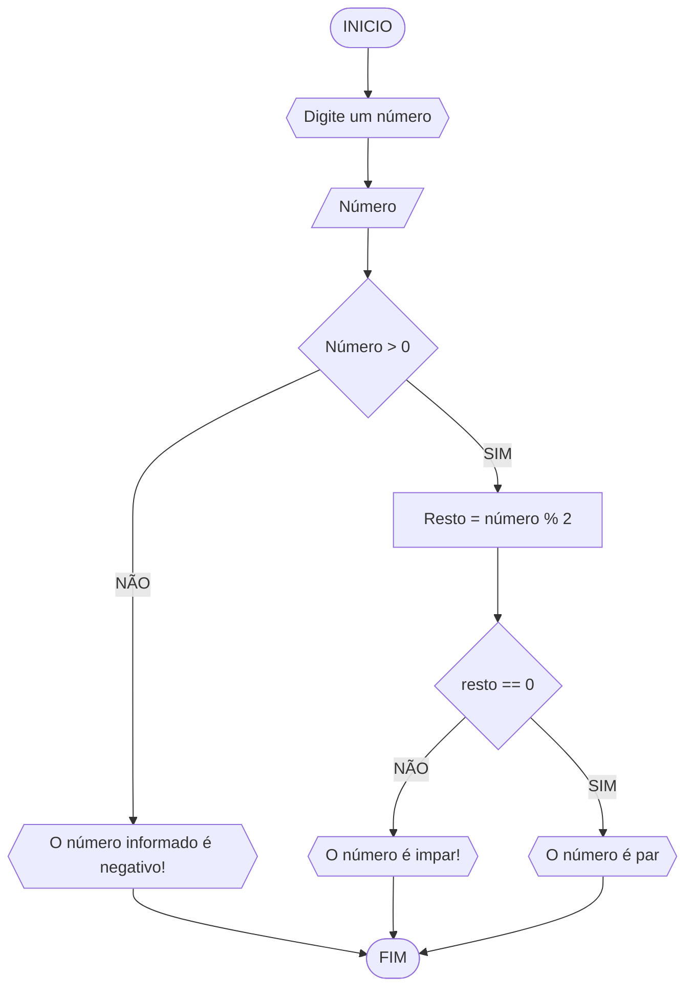

# UNIFOR
**Disciplina**: Raciocínio lógico e algoritmo
**Orientador**: Professor Carubbi

 ## Lista de exercícios

### Exercício 03

#### Fluxograma

#### Pseudocódigo
```
1  ALGORITMO verifica_par_impar
2  DECLARE numero, esto NUMERICO
3  ESCREVA "Digite um número:"
4  LEIA numero
5  SE numero > 0 ENTAO
6      resto = numero % 2
7      SE resto == 0 ENTAO
8       ESCREVA "numero é par"
9     SENÃO
10      ESCREVA "numero é impar"
11    SENÃO
12      ESCREVA "O numero deve ser positivo!"
13  FIM_ALGORITMO


```
