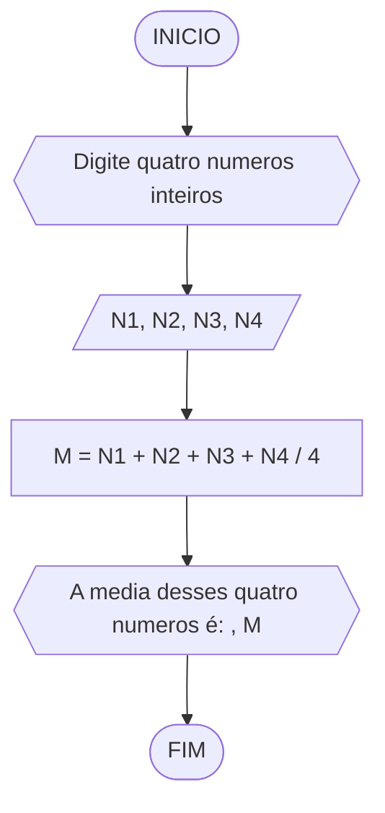
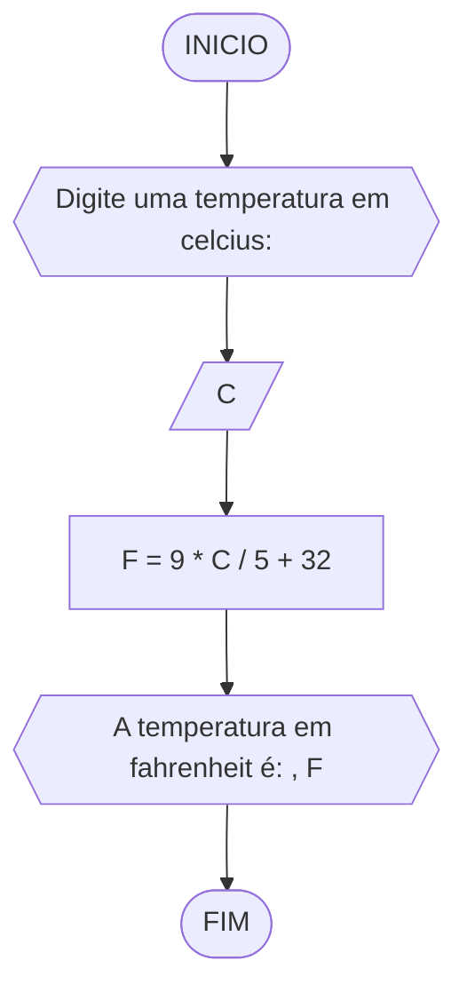
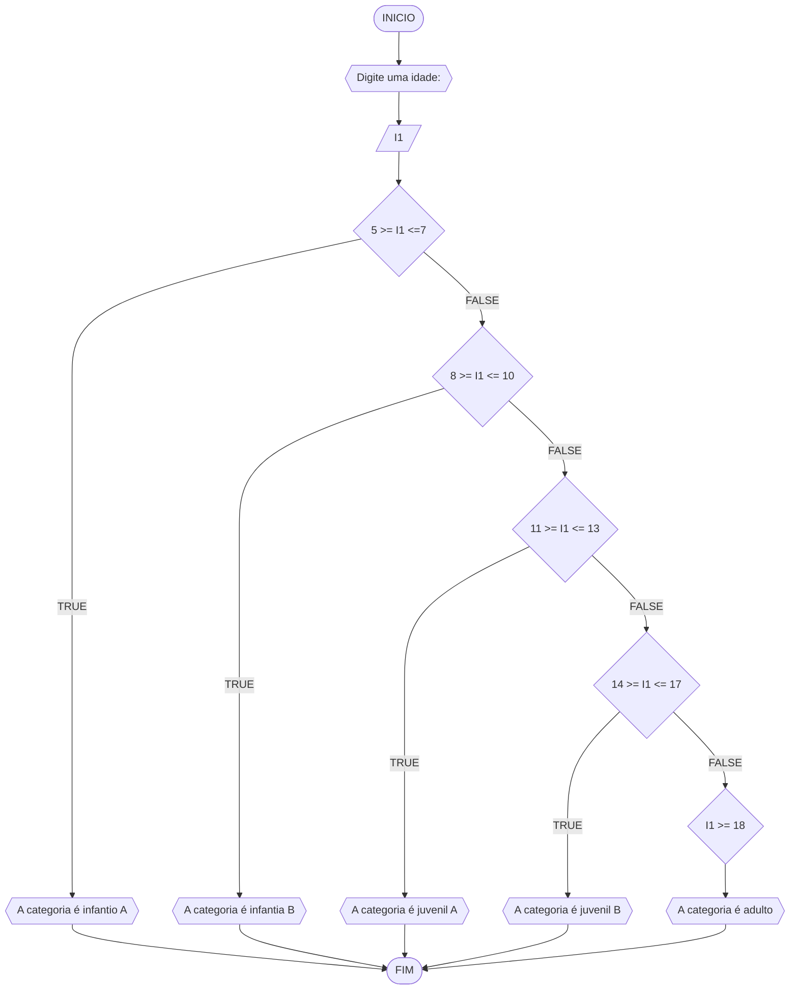

# UNIFOR
**Nome**: Gustavo Mendonça <br>
**Disciplina**: Raciocínio lógico algorítmico

 ## Lista de exercícios

### Exercício 01 (2.5 pontos)
Calcule a média de quatro números inteiros dados.

#### FLUXOGRAMA


#### PSEUDOCODIGO

```
ALGORITMO media
DECLARE N1, N2, N3, N4 INTEIROS
INICIO
ESCREVA "Digite quatro numeros inteiros: "
LEIA N1, N2, N3, N4
M = N1 + N2 + N3 + N4 / 4 ENTAO
	ESCREVA "A media desses quatro numeros é: ", M
FIM


```

#### Teste de mesa (0.5 ponto)

| N1 | N2 | N3 | N4 | M | SAIDA | 
|      --      |      --      |      --      |      --      |      --      |      --      | 
| 2     | 4       | 6    |  8     | 5    |      Média = 5      |
| 1   | 3          | 5        | 7 | 4  |      Média = 4      |

### Exercício 02 (2.5 pontos)
Leia uma temperatura dada em Celsius (C) e imprima o equivalente em Fahrenheit (F). (Fórmula de conversão: F = (9/5) * C + 32)

#### FLUXOGRAMA


#### PSEUDOCODIGO


```
ALGORITMO temperatura
DECLARE C, F REAIS
INICIO
ESCREVA "Digite uma temperatura em celcius: "
LEIA C
F = 9 * C / 5 + 32 ENTAO
	ESCREVA "A temperatura em fahrenheit é: ", F
FIM


```

#### Teste de mesa (0.5 ponto)

| nome_coluna1 | nome_coluna2 | nome_coluna3 | nome_coluna4 | nome_coluna5 | 
|      --      |      --      |      --      |      --      |      --      | 
| Adicione     | espaço       | se quiser    |  alinhar     | as barras    |
| verticais,   | mas          | não é        | obrigatório. | Entendido ?  |

### Exercício 03 (2.5 pontos)
Receba dois números reais e um operador e efetue a operação correspondente com os valores recebidos (operandos). 
O algoritmo deve retornar o resultado da operação selecionada simulando todas as operações de uma calculadora simples.


#### FLUXOGRAMA


#### PSEUDOCODIGO
```
ALGORITMO categoria
DECLARE I1 NUMERAIS
INICIO
ESCREVA "Digite uma idade: "
LEIA I1
SE I1 5 >= I1 <= 7 ENTAO
	ESCREVA "A categoria é infantil A"
	SENAO
	8 >= I1 <= 10 ENTAO
		ESCREVA "A categoria é infantia B"
		SENAO 
		11 >= I1 <= 13 ENTAO
			ESCREVA "A categoria é juvenil A"
			SENAO 
			14 >= I1 <= 17 ENTAO
				ESCREVA "A categoria é juvenil B"
				SENAO
				I1 >= 18 ENTAO 
					ESCREVA "A categoria é adulto"
				FIM_SE
			FIM_SE
		FIM_SE
	FIM_SE
FIM
				
	
		

```


#### Teste de mesa (0.5 ponto)

| I1 | SAIDA | 
|      --      |      --      | 
| 5     | A categoria é infantil A       |
| 11   | A categoria é juvenil A          |
| 18   | A categoria é adulta         |
| 15   | A categoria é juvenil B          |

### Exercício 04 (2.5 pontos)
Elaborar um algoritmo que, dada a idade, classifique nas categorias: infantil A (5 - 7 anos), infantil B (8 -10 anos), juvenil A (11 - 13 anos), juvenil B (14 -17 anos) e adulto (maiores que 18 anos).

#### FLUXOGRAMA


#### PSEUDOCODIGO
```
ALGORITMO categoria
DECLARE I1 NUMERAIS
INICIO
ESCREVA "Digite uma idade: "
LEIA I1
SE I1 5 >= I1 <= 7 ENTAO
	ESCREVA "A categoria é infantil A"
	SENAO
	8 >= I1 <= 10 ENTAO
		ESCREVA "A categoria é infantia B"
		SENAO 
		11 >= I1 <= 13 ENTAO
			ESCREVA "A categoria é juvenil A"
			SENAO 
			14 >= I1 <= 17 ENTAO
				ESCREVA "A categoria é juvenil B"
				SENAO
				I1 >= 18 ENTAO 
					ESCREVA "A categoria é adulto"
				FIM_SE
			FIM_SE
		FIM_SE
	FIM_SE
FIM
				
	
		

```


#### Teste de mesa (0.5 ponto)

| I1 | SAIDA | 
|      --      |      --      | 
| 5     | A categoria é infantil A       |
| 11   | A categoria é juvenil A          |
| 18   | A categoria é adulta         |
| 15   | A categoria é juvenil B          |
