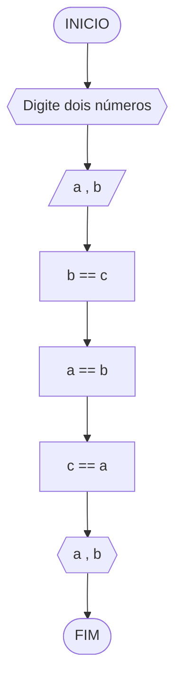

# CONTEÚDO PRÁTICO
## Dadas duas variáveis, a e b, implemente e teste um algoritmo para trocar os valores atribuídos a elas.



#### Pseudocódigo
```
1 ALGORITMO TrocaValores
2 DECLARE a , b : inteiro;
3 b ← c
4 a ← b
5 c ← a
6 ESCREVA a , b
7 FIM_ALGORITMO

```
