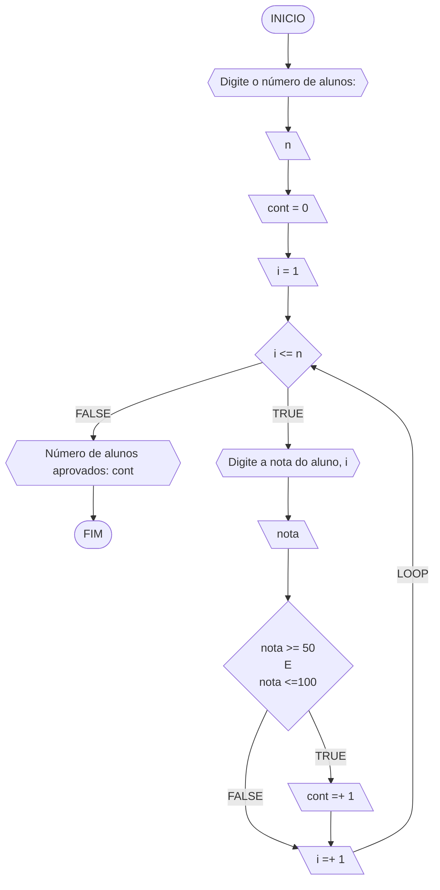
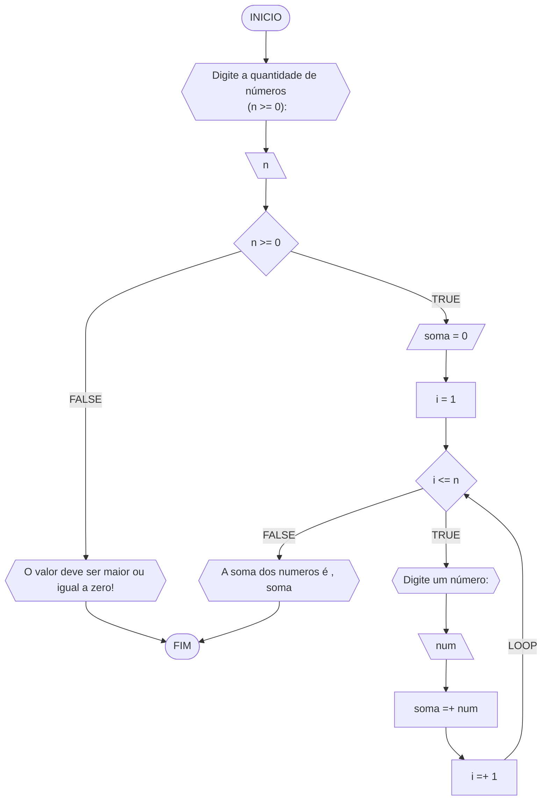
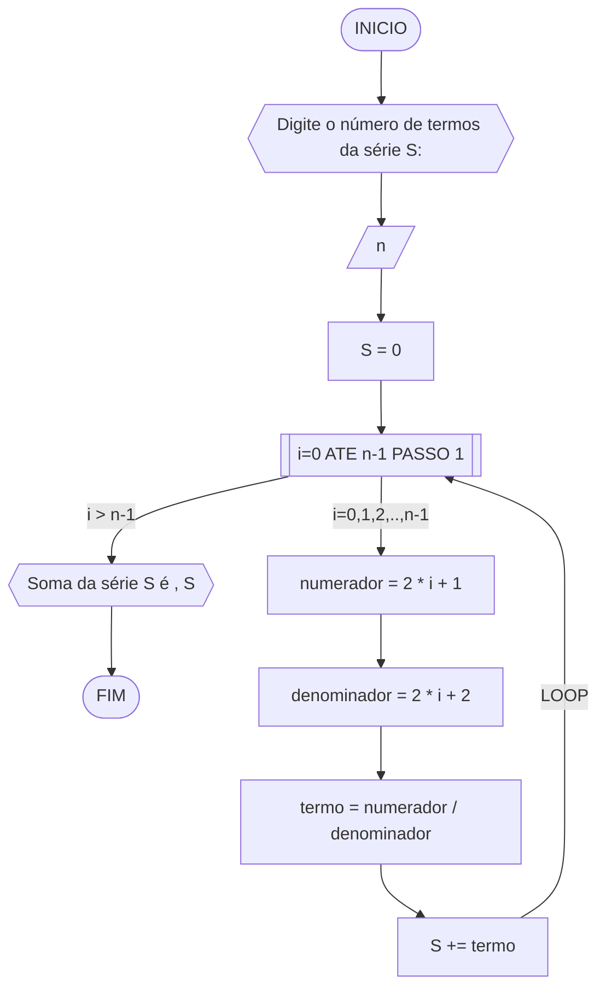
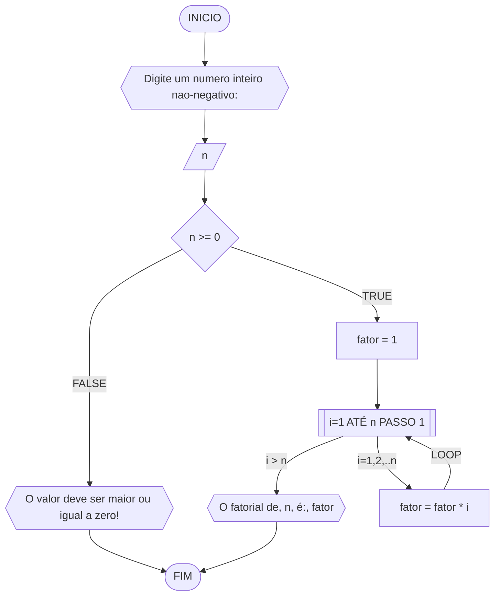
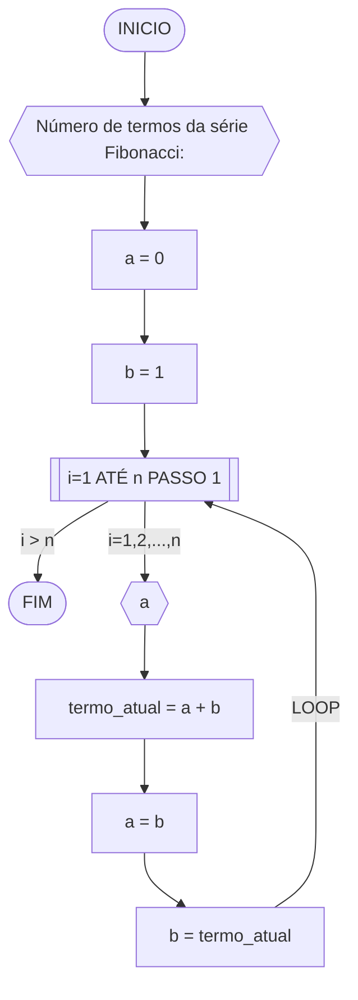
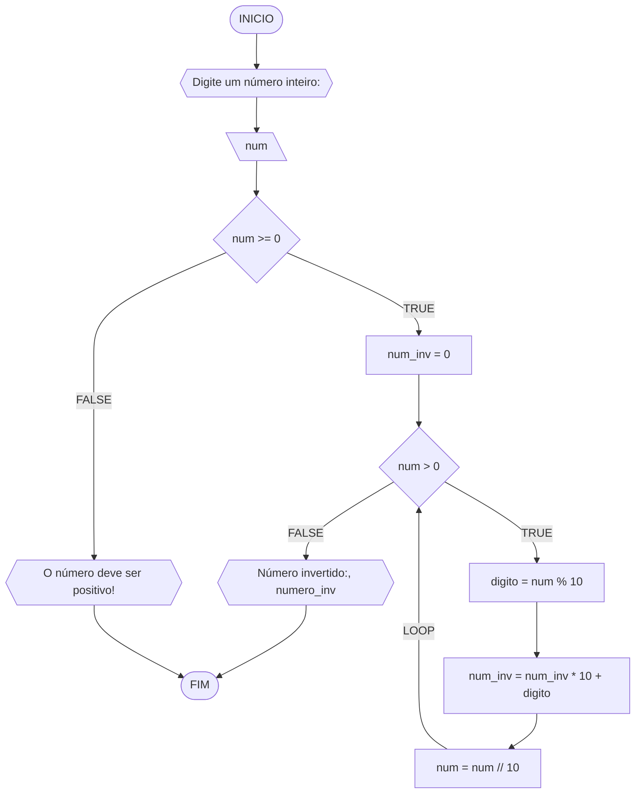

**Curso:** Engenharia da Computação <br>
**Disciplina:** Raciocínio lógico e algoritmo <br>
**Código/Turma:** T998-21 / T998-31 <br>
**Professor:** Ricardo Carubbi <br>
**Data:**  <br>
**Aluno(a):** Gustavo Mendonça de Sousa Meneses <br>
**Matrícula:** 2410332 <br>

**1a chamada (Sim/Não):** preencha com a opção correta <br>
**2a chamada (Sim/Não):** preencha com a opção correta
### Questão 1
Dadas duas variáveis, a e b, implemente e teste um algoritmo para trocar os valores atribuídos a elas.


#### Pseudocódigo
```java
 ALGORITMO TrocaValores
 DECLARE a , b : inteiro;
    //variáveis "a" e "b" como dados de entrada
    1 ESCREVA "Digite dois números"
    2 LEIA a , b
    //troca de valores das variáveis
    3 b ← c
    4 a ← b
    5 c ← a
    //exibe uma mensagem com os novos valores das variáveis
    6 ESCREVA a , b
7 FIM_ALGORITMO

```
### Questão 2 - Contagem (1 ponto)

Dado um conjunto $n$ de notas de alunos em um exame, implemente e teste um algoritmo para fazer uma contagem $cont$ do número de alunos que foram aprovados no exame. 
Será considerado aprovado o aluno que tirar $nota$ 50 ou maior (no intervalo de 0 a 100).

#### Descrição geral do algoritmo

1. Obter o número de notas $n$ a serem processadas;
2. Inicializar a contagem $cont$ com zero;
3. Enquanto houver notas a serem processadas, fazer repetidamente:
    - obter a próxima nota;
    - se a nota for suficiente para passar no exame ($n ≥ 50$) então adicionar 1 (um) à contagem $cont$;
4. Exibir a contagem $cont$ (número total de aprovações).

#### Fluxograma 01
Fluxograma conforme descrição do algoritmo acima, usando o loop ENQUANTO.


#### Pseudocódigo 01 (1 ponto)

```java
ALGORTIMO ContaAprovacoes
DECLARE n, cont, nota, i: INTEIRO
INICIO
 //exibe a mensagem para a entrada de dados
    ESCREVA "Digite a quantidade de notas dos alunos:"
//armazena o valor da entrada na variável "n"
    LEIA n
// Inicializa o contador de alunos aprovados
    cont = 0
// Loop contado (loop for) executa as instruções a cada iteração dos valores de 'i' de 1 até n, incrementando 'i' em 1.
    PARA i DE 1 ATE n PASSO 1 FAÇA
        ESCREVA "Digite a nota do aluno", i, ":"
        LEIA nota
        SE nota >= 50 E nota <= 100 ENTAO
 // Incrementa o contador de alunos aprovados
            cont = cont + 1        
        FIM_SE
    FIM_PARA
 //exibe uma mensagem apresentando a quantidade de alunos aprovados
    ESCREVA "O numero de alunos aprovados e:", cont
FIM
```

### Questão 3 - Soma de um conjunto de números (1 ponto)

Dado um conjunto de $n$ números, implemente e teste um algoritmo para calcular a soma desses números. <br>
Aceite apenas $n$ maior ou igual a zero.

#### Descrição geral do algoritmo

1. Obter a quantidade de números $n$ a serem somados.
2. Inicializar a variável $soma$ com 0 (zero).
3. Enquanto menos do que $n$ números tiverem sido somados, fazer repetidamente:
    - obter o próximo número $i$;
    - calcular a soma atual, adicionando o número $i$ obtido à soma mais recente;
4. Exibir a soma dos $n$ números

#### Fluxograma



#### Pseudocódigo (1 ponto)

```java
Algoritmo SomaNumeros
DECLARE n,i,soma: INTEIRO       
INICIO
    //exibe a mensagem para a entrada de dados
    ESCREVA "Digite a quantidade de números<br> (n >= 0):"
    //armazena o valor da variável "n"
    LEIA n
 //estrutura condicional com base no valor da variável m        
    SE n >=0 ENTAO  
        //variável soma iniciada com o valor de 0
        soma <- 0
        i <- i
        //loop condicional (loop while) executa as instruções enquanto a condição "i <= n" for verdadeira
        ENQUANTO i <= n FAÇA
            //exibe uma mensagem para a entrada de uma outra variável       
            ESCREVA "Digite um número:"
            //armazena o valor da variável num
            LEIA num
            //incrementa a soma conforme a iteração da variável num
            soma <- soma + num
            //incrementa a variável i
            i <- i + 1
       FIM_ENQUANTO
    SENAO
       //mensagem exibida caso a estrutura condicional seja falsa    
        "O valor deve ser maior ou igual a zero!"
    FIM_SE
//exibe uma mensagem apresentando a soma dos números
    ESCREVA "A soma dos numeros é , soma"
FIM
```

### Questão 4 - Cálculo de uma série (1 ponto)

Dado um conjunto de $n$ termos da série, implemente e teste um algoritmo para calcular o valor de S, conforme definido abaixo:

$$ S = \frac{1}{2} + \frac{3}{4} + \frac{5}{6} + \frac{7}{8} + \dots $$

#### Descrição geral do algoritmo

1. Obter o número de termos $n$;
2. Inicializar a variável $S$ com 0 (zero).
3. Iterar o valor de $n$ na variável $i$ iniciando com 0 (zero), de acordo com as instruções abaixo:
    - calcular o numerador na variável $numerador$;
    - calcular o denominador  na variável $denominador$;;
    - calcular o termo da série na variável $termo$, onde $termo = numerador/denominador$;
    - adicionar esse termo à variável $S$.
4. Exibir o valor da série $S$.

#### Fluxograma



#### Pseudocódigo (1 ponto)

```java
Algoritmo SomaSerie
DECLARE n,numerador,denominador: INTEIRO; S: REAL
INICIO
//exibe a mensagem para a entrada de dados
    ESCREVA "Digite o número de termos da série S:"
//armazena o valor da variável "n"
    LEIA n
//variável S iniciada com o valor de 0
    S <- 0
    //laço de repetição com o contador i indo de 0 até n-1 incrementando 1 a cada looping
    PARA i de 0 ATÉ n-1 PASSO 1 FAÇA
        //processamento para calcular numerador e denominador
        numerador = 2 * i + 1
        denominador <- 2 * i + 2
        termo = numerador / denominador
        //incrementação do termo dentro da séries
        S += termo
    FIM_PARA
    ESCREVA "Soma da série S é ", S
FIM
```

#### Tabela de testes (0.25 ponto)

| it | n  | S  | i | numerador | denominador | termo | S += termo     | saída                  |
| -- | -- | -- |-- | --        | --          | --    | --             | --                     |
|    | 0  | 0  |   |           |             |       |                |                        |
| 1  | 4  | 0  | 0 | 2*0+1 = 1 | 2*0+2 = 2   | 1/2   | 0+1/2 = 1/2    |                        |
| 2  | 4  | 0  | 1 | 2*1+1 = 1 | 2*1+2 = 2   | 3/4   | 1/2+3/4 = 1.25 |                        |
| 3  | 4  | 0  | 2 | 2*2+1 = 1 | 2*2+2 = 2   | 5/6   | 0+1/2 = 2.08   |                        |
| 4  | 4  | 0  | 3 | 2*3+1 = 1 | 2*3+2 = 2   | 7/8   | 0+1/2 = 2.96   | Soma da série S é 2.96 |

### Questão 5 - Cálculo fatorial (2 pontos)

Dado um número $n$, implemente e teste um algoritmo para calcular o fatorial de $n$ (escrito como $n!$), onde $n ≥ 0$.

#### Descrição geral do algoritmo

1. Obter o número $n$, onde $n \geq 0$;
2. Inicializar a variável $fator$ com 1 (um) para armazenar o resultado do cálculo do fatorial;
3. Iterar o valor de $n$ na variável $i$, ou seja, executar $n$ vezes, as instruções abaixo:
    - Incrementar o valor atual $fator$ multiplicando pelo valor de $i$;
4. Exibir o resultado ($n!$).

#### Fluxograma



#### Pseudocódigo (2 pontos)

```java
ALGORITMO CalcFatorial
DECLARE n: INTEIRO
INICIO
    //exibe a mensagem para a entrada de dados
    ESCREVA "Digite um numero inteiro nao-negativo:"
    //armazena o valor da variável "n"
    LEIA n
    //estrutura condicional baseada na variável n
    SE n >= 0 ENTAO
        //variável fator iniciada com o valor de 1
        fator <- 1
        //laço de repetição com o contador i indo de 1 até n incrementando 1 a cada looping
        PARA i DE 1 ATÉ n PASSO 1 FAÇA
            //incrementação o fator multiplicado pela variável 1
            fator <- fator * i        // fator *= i
        FIM_PARA
        //exibe uma mensagem apresentando a fatorial da variável
        ESCREVA "O fatorial de, n, é:", fator
    SENAO
        //exibe uma mensagem caso a condicional seja falsa
        ESCREVA "O valor deve ser maior ou igual a zero!"
    FIM_SE
FIM
```

#### Tabela de testes

| n  | fator | i  | fator = fator * i | saída               |
| -- | --    | -- | --                | --                  |
| 3  | 1     | 1  | 1*1 = 1           |                     |
| 3  | 1     | 2  | 1*2 = 2           |                     |
| 3  | 2     | 3  | 2*3 = 6           | O fatorial de 3 é 6 |

### Questão 6 - Geração da sequência de Fibonacci (2 pontos)

Gerar e imprimir os $n$ primeiros termos da sequência de Fibonacci, onde $n ≥ 1$. <br>
Os primeiros termos são: $0, 1, 1, 2, 3, 5, 8, 13, \dots$. Cada termo, além dos dois primeiros, é derivado da soma dos seus dois antecessores mais próximos.

#### Descrição geral do algoritmo

1. Obter o número de termos $n$, onde $n \geq 1$;
2. Inicializar os dois primeiros termos da série nas variável $a$ e $b$ com 0 (zero);
3. Iterar o valor de $n$, ou seja, executar $n$ vezes, as instruções abaixo:
    - Imprimir o termo inicial $a$ (instrução para exibir a sequência ao atualizar a variável $a$);
    - Somar os termos $a$ e $b$ na variável $termo_atual$;
    - Atribuir a variável $a$ o valor da variável $b$;
    - Atribuir a variável $b$ o valor da variável $termo_atual$.

#### Fluxograma



#### Pseudocódigo (2 pontos)

```java
Algoritmo GeraFibonacci
DECLARE n, a, b, termo_atual: INTEIRO
INICIO
    //exibe a mensagem para a entrada de dados
    ESCREVA "Número de termos da série Fibonacci:"
    //armazena o valor da variável n
    LEIA n
    //variável a iniciada com o valor de 0
    a <- 0
    //variável b iniciada com o valor de 1
    b <- 1
    //laço de repetição com o contador i indo de 1 até n
    PARA i DE 1 ATE n FAÇA
        //armazena a variável a
        ESCREVA a
        //armazena a variável "termo_atual" como soma das variáveis "a" e "b"
        termo_atual <- a + b
        //define a variável "b" como "a"
        a <- b
        //define a variável "termo_atual" como "b" , atualizando-as para dar continuidade à sequência de fibonacci
        b <- termo_atual
    FIM_PARA
FIM

```
#### Tabela de testes

| it | n  | a  | b  | i  | saída | termo_atual = a + b | a = b | b = termo_atual |
| -- | -- | -- | -- | -- | --    | --                  | --    | --              |
| 1  | 5  | 0  | 1  | 1  | 0     | 0 + 1 = 1           | 1     | 1               |
| 2  | 5  | 1  | 1  | 2  | 1     | 1 + 1 = 2           | 1     | 2               |
| 3  | 5  | 1  | 2  | 3  | 1     | 1 + 2 = 3           | 2     | 3               |
| 4  | 5  | 2  | 3  | 4  | 2     | 2 + 3 = 5           | 3     | 5               |
| 4  | 5  | 3  | 5  | 5  | 3     | 3 + 5 = 8           | 5     | 8               |

### Questão 7 - Inversão dos dígitos de um número inteiro (2 pontos)

Implemente e teste um algoritmo para inverter a ordem dos dígitos de um número inteiro positivo.

#### Descrição geral do algoritmo

1. Obter o número inteiro positivo $num$ a ser invertido;
2. Inicializar a variável $num \textunderscore inv$ com 0 (zero);
3. Enquanto o número for maior que zero ($num > 0$), faça repetidamente:
    - Calcular o último dígito do número na variável $digito$;
    - Adicionar o dígito ao número invertido $num \textunderscore inv$;
    - Remover o último dígito do número original $num$; 
4. Exibir o número invertido.

#### Fluxograma



#### Pseudocódigo (2 pontos)

```java
Algoritmo InverteInteiro
DECLARE num, num_inv, digito: INTEIRO
INICIO
    //exibe a mensagem para a entrada de dados
    ESCREVA "Digite um número inteiro:"
    //armazena o valor da variável num
    LEIA num
    //estrutura condicional baseada na variável num
    SE num >= 0 ENTAO
        //variável num_inv iniciada com o valor 0
        num_inv <- 0
        //loop condicional (loop while) que executa as instruções enquanto a condição "num > 0" for verdadeira
        ENQUANTO num > 0 FAÇA
            //determinar o último digito da variável num calculando o resto de sua divisão por 10
            digito <- num % 10
            //atualiza a variável num_inv
            num_inv <- (num_inv * 10) + digito
            //substitui o valor da varável num pela sua divisão inteira por 10
            num <- num // 10
        //exibe uma mensagem apresentando a inversão dos valores da variável num     
        ESCREVA "Número invertido:", num_inv
    SENAO
        //exibe uma mensagem de negação caso a estrutura condicional seja falsa
        ESCREVA "O número deve ser positivo!"
    FIM_SE
FIM
```

#### Tabela de testes

| it | num | num_inv | num > 0 | digito | num = num // 10 | num_inv = (num_inv * 10) + digito | Saída                        |
| -- | --  | --      | --     | --      | --              | --                                | --                           |
|    | -1  | 0       | False  |         |                 |                                   | O número deve ser positivo!  |
| 1  | 0   | 0       | False  |         |                 |                                   | Número invertido:: 0         |
| 1  | 42  | 0       | True   | 2       | 4               | 2                                 |                              |
| 2  | 4   | 2       | True   | 4       | 0               | 24                                |                              |
| 3  | 0   | 24      | False  |         |                 |                                   | Número invertido:: 24        |
