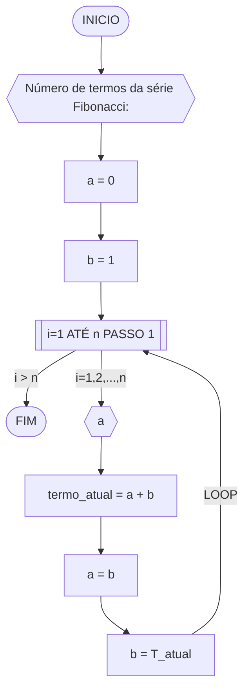

# CONTEÚDO PRÁTICO
## Dadas duas variáveis, a e b, implemente e teste um algoritmo para trocar os valores atribuídos a elas.


#### Pseudocódigo
```
1 ALGORITMO TrocaValores
2 DECLARE a , b : inteiro;
3 b ← c
4 a ← b
5 c ← a
6 ESCREVA a , b
7 FIM_ALGORITMO

```
### Questão 2 - Contagem (1 ponto)

Dado um conjunto $n$ de notas de alunos em um exame, implemente e teste um algoritmo para fazer uma contagem $cont$ do número de alunos que foram aprovados no exame. 
Será considerado aprovado o aluno que tirar $nota$ 50 ou maior (no intervalo de 0 a 100).

#### Descrição geral do algoritmo

1. Obter o número de notas $n$ a serem processadas;
2. Inicializar a contagem $cont$ com zero;
3. Enquanto houver notas a serem processadas, fazer repetidamente:
    - obter a próxima nota;
    - se a nota for suficiente para passar no exame ($n ≥ 50$) então adicionar 1 (um) à contagem $cont$;
4. Exibir a contagem $cont$ (número total de aprovações).

#### Fluxograma 01
Fluxograma conforme descrição do algoritmo acima, usando o loop ENQUANTO.


#### Pseudocódigo 01 (1 ponto)

```
Algoritimo aprovação
DECLARE N_ver, N_aprov, N_notas, i: Int
	notas: Float
INICIO
N_aprov = 0 
ESCREVA "Digite a quanidade de notas para avaliar"
LEIA N_notas
ENQUANTO N_notas <= 0 REPITA
	ESCREVA "Digite uma quantidade válida"
	LEIA N_notas
PARA N_ver DE 1 ATÉ N_notas FAÇA [PASSO 1]
	ESCREVA "Insira a nota"
	LEIA nota
	SE nota >= 50 E nota <= 100
		N_aprov =+ 1
		N_ver =+ 1
	SENÃO
		N_ver =+ 1
	FIM_SE
FIM_PARA
ESCREVA "A quantidade de notas aprovadas foi", N_aprov
FIM_ALGORÍRIMO
```

### Questão 3 - Soma de um conjunto de números (1 ponto)

Dado um conjunto de $n$ números, implemente e teste um algoritmo para calcular a soma desses números. <br>
Aceite apenas $n$ maior ou igual a zero.

#### Descrição geral do algoritmo

1. Obter a quantidade de números $n$ a serem somados.
2. Inicializar a variável $soma$ com 0 (zero).
3. Enquanto menos do que $n$ números tiverem sido somados, fazer repetidamente:
    - obter o próximo número $i$;
    - calcular a soma atual, adicionando o número $i$ obtido à soma mais recente;
4. Exibir a soma dos $n$ números

#### Fluxograma


#### Pseudocódigo (1 ponto)
```
Algoritmo soma_de_valores
DECLARE num_somados, num_soma: Int
	num, soma: Float
INICIO
soma = 0
ESCREVA "Digite o número de elementos do conjunto que você quer somar"
LEIA num_soma
ENQUANTO num_soma <= 0 FAÇA
	ESCREVA "Digite uma quantidade válida"
	LEIA num_soma
FIM_ENQUANTO
PARA num_somados DE 1 até Num_soma [PASSO 1] FAÇA
	ESCREVA "Digite um número"
	LEIA num
	soma =+ num
FIM_PARA
ESCREVA "O valor da soma total é", soma
FIM_ALGORITMO
```

### Questão 4 - Cálculo de uma série (1 ponto)

Dado um conjunto de $n$ termos da série, implemente e teste um algoritmo para calcular o valor de S, conforme definido abaixo:

$$ S = \frac{1}{2} + \frac{3}{4} + \frac{5}{6} + \frac{7}{8} + \dots $$

#### Descrição geral do algoritmo

1. Obter o número de termos $n$;
2. Inicializar a variável $S$ com 0 (zero).
3. Iterar o valor de $n$ na variável $i$ iniciando com 0 (zero), de acordo com as instruções abaixo:
    - calcular o numerador na variável $numerador$;
    - calcular o denominador  na variável $denominador$;;
    - calcular o termo da série na variável $termo$, onde $termo = numerador/denominador$;
    - adicionar esse termo à variável $S$.
4. Exibir o valor da série $S$.

#### Fluxograma


#### Pseudocódigo (1 ponto)

```
Algoritmo soma_da_serie
DECLARE Num_termo, termo: Int
	S: Float
INICIO
S = 0
ESCREVA "Digite a quantidade de termos da série que você quer somar"
LEIA Num_termo // 3 
ENQUANTO Num_termo < 0 FAÇA
	ESCREVA "Digite uma quantidade válida"
	LEIA Num_termo
FIM_ENQUANTO
PARA termo DE 1 ATÉ Num_termo [PASSO 1] FAÇA
	S =+ (2 * termo - 1)/(2 * termo)
FIM_PARA
ESCREVA "O valor da soma de", Num_termo, "termo(s) da série é", S
FIM_ALGORITMO
```


### Questão 5 - Cálculo fatorial (2 pontos)

Dado um número $n$, implemente e teste um algoritmo para calcular o fatorial de $n$ (escrito como $n!$), onde $n ≥ 0$.

#### Descrição geral do algoritmo

1. Obter o número $n$, onde $n \geq 0$;
2. Inicializar a variável $fator$ com 1 (um) para armazenar o resultado do cálculo do fatorial;
3. Iterar o valor de $n$ na variável $i$, ou seja, executar $n$ vezes, as instruções abaixo:
    - Incrementar o valor atual $fator$ multiplicando pelo valor de $i$;
4. Exibir o resultado ($n!$).

#### Fluxograma


#### Pseudocódigo (2 pontos)

```
Algoritmo fatorial
DECLARE fato, n_mult, n: Int
INICIO
n_mult = 0
ESCREVA "Digite o numero do fatorial que voce quer calcular"
LEIA n
ENQUANTO n < 0 FAÇA
	ESCREVA "Digite um fatorial válido"
	LEIA n
FIM_ENQUANTO
PARA n_mult DE 1 PARA n [PASSO 1] FAÇA
	n_mult =+ 1
	fato = fato * n_mult
FIM_PARA
ESCREVA "O valor do fatorial de", n, "é", fato 
FIM_ALGORITMO
```


### Questão 6 - Geração da sequência de Fibonacci (2 pontos)

Gerar e imprimir os $n$ primeiros termos da sequência de Fibonacci, onde $n ≥ 1$. <br>
Os primeiros termos são: $0, 1, 1, 2, 3, 5, 8, 13, \dots$. Cada termo, além dos dois primeiros, é derivado da soma dos seus dois antecessores mais próximos.

#### Descrição geral do algoritmo

1. Obter o número de termos $n$, onde $n \geq 1$;
2. Inicializar os dois primeiros termos da série nas variável $a$ e $b$ com 0 (zero);
3. Iterar o valor de $n$, ou seja, executar $n$ vezes, as instruções abaixo:
    - Imprimir o termo inicial $a$ (instrução para exibir a sequência ao atualizar a variável $a$);
    - Somar os termos $a$ e $b$ na variável $termo_atual$;
    - Atribuir a variável $a$ o valor da variável $b$;
    - Atribuir a variável $b$ o valor da variável $termo_atual$.

#### Fluxograma



#### Pseudocódigo (2 pontos)

```
Algoritimo fibonacci
DECLARE a, b, T_atual, n, i: Int
INICIO
a = 0
b = 1
ESCREVA "Digite qual termo de fibonacci você quer calcular"
LEIA TS
ENQUANTO n <= 0 FAÇA
	ESCREVA "Digite um termo válido"
	LEIA n
FIM_ENQUANTO
PARA i DE 1 ATÉ TS [PASSO 1] FAÇA
	ESRCREVA a
	Tmem = a + b
	a = b
	b = T_atual
FIM_PARA
FIM_ALGORITIMO
```

### Questão 7 - Inversão dos dígitos de um número inteiro (2 pontos)

Implemente e teste um algoritmo para inverter a ordem dos dígitos de um número inteiro positivo.

#### Descrição geral do algoritmo

1. Obter o número inteiro positivo $num$ a ser invertido;
2. Inicializar a variável $num \textunderscore inv$ com 0 (zero);
3. Enquanto o número for maior que zero ($num > 0$), faça repetidamente:
    - Calcular o último dígito do número na variável $digito$;
    - Adicionar o dígito ao número invertido $num \textunderscore inv$;
    - Remover o último dígito do número original $num$; 
4. Exibir o número invertido.

#### Fluxograma


#### Pseudocódigo (2 pontos)

```
Algoritimo Inver
DECLARE Num, Num_inv, mem, mem2: Int
INICIO
ESCREVA "Digite o número que voce quer inverter"
LEIA Num
mem2 = Num
ENQUANTO Num <= 9 FAÇA
	ESCREVA "O número precisa ser positivo e ter mais de dois algarismos"
	ESCREVA "Digite o número que voce quer inverter"
FIM_ENQUANTO
ENQUANTO Num > 0 FAÇA
	mem = Num % 10
        Num =// 10
	Num_inv =* 10
	Num_inv =+ mem
FIM_ENQUANTO
ESCREVA "O número", mem2, "após inverter os algarismos é", Num_inv
FIM_ALGORITIMO 
```
