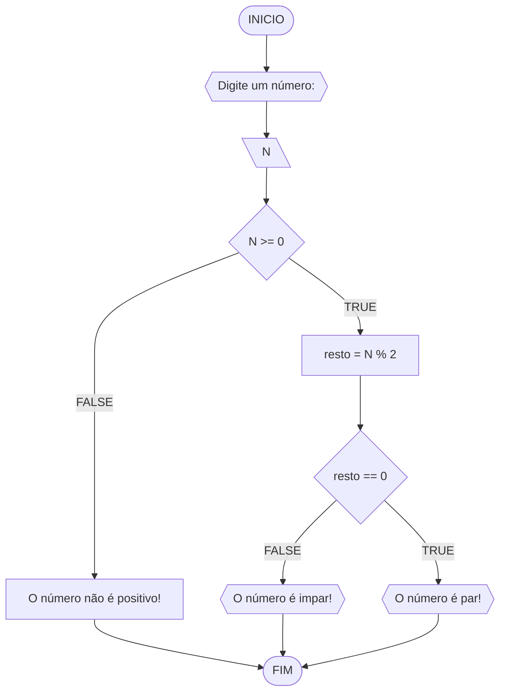
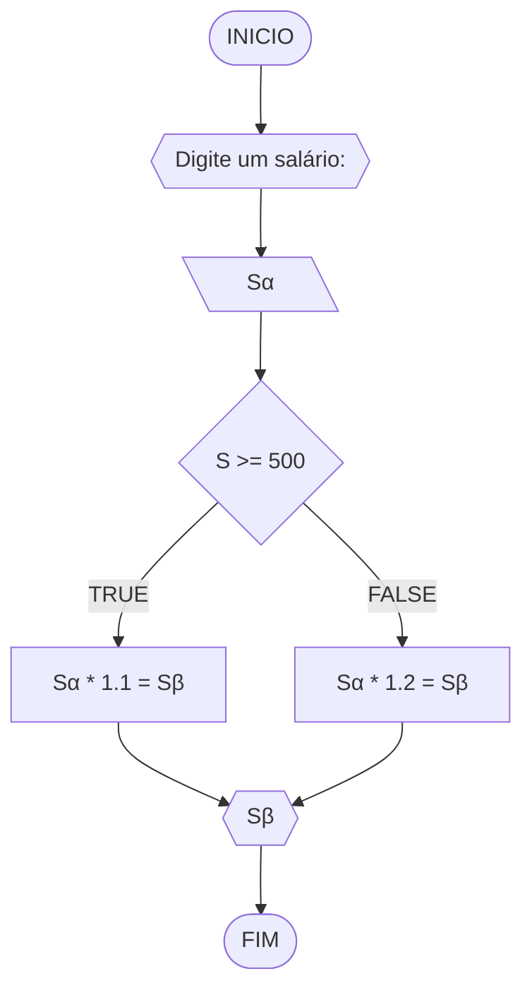
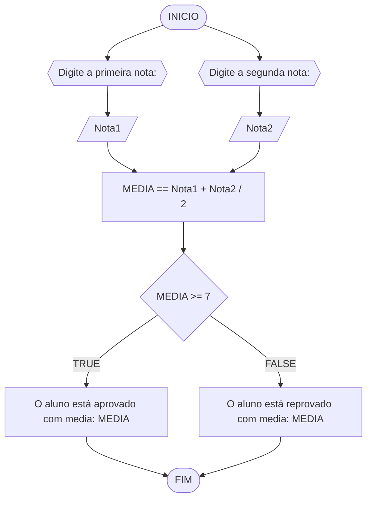

# UNIFOR
**Nome**: Gustavo Mendonça <br>
**Disciplina**: Raciocínio lógico algorítmico

## Lista de exercícios 01

### Exercício 01 
Represente, em fluxograma e pseudocódigo, um algoritmo para determinar se um número inteiro e positivo é par ou impar.

#### Fluxograma 




#### Pseudocódigo 
```
1  ALGORTIMO verifica_par_impar
2  DECLARE N, resto: INTEIRO
3  ESCREVA "Digite um número: "
4  INICIO
4  LEIA numero
5  SE numero >= 0 ENTAO                 
6    resto = numero % 2               
7    SE resto == 0 ENTAO                
8      ESCREVA "O número é par!"
9    SENAO
10     ESCREVA "O número é impar!"
11   FIM_SE
11  SENAO                                // caso inteiro for negativo (condição linha 5)
12    ESCREVA "O número deve ser postivo!"
13  FIM_SE
13 FIM
```
#### Teste de mesa (0,25 ponto)
| N | N >= 0 | resto | resto == 0 | Saída |
| -- | -- | -- | -- | -- | 
| -4 | F |   |   | "O número deve ser postivo!" |
| 0  | V | 0 | V | "O número é par!" |
| 17 | V | 1 | F | "O número é impar!" |
| 60 | V | 0 | V | "O número é par!" |

###  Exercício 02


#### PSEUDOCODIGO

```mermaid
flowchart TD
ALGORITMO verificar_NOVO SALARIO
DECLARE Sα, Sβ NUMERICOS
ESCREVA "Digite seu salario atual: "
LEIA Sα
SE Sα >= 500 ENTAO
	Sβ = Sα * 1.1
SENAO
	Sβ = Sα * 1.2
ESCREVA "Seu novo salario é: ", Sβ
FIM ALGORITMO
```
#### Teste de mesa (1.0 ponto)

| Salário | Sα >= 500 | Saída |
|      --      |      --      |      --      |     
| 500     | V       | Sβ = Sα * 1.1    |  
| 300   | F          | Sβ = Sα * 1.2        | 

#### EXERCÍCIO 03




#### PSEUDOCÓDIGO

```
ALGORITMO verificar_MEDIA
Declare Nota1, Nota2, MEDIA NUMERICO
ESCREVA "Digite a primeira nota do aluno: "
LEIA Nota1
ESCREVA "Digite a segunda nota do aluno: "
LEIA Nota2
MEDIA = (Nota1 +Nota2) / 2
SE MEDIA >= 7 ENTAO
	ESCREVA "O aluno foi aprovado com média igual: ", MEDIA
SENAO
	ESCREVA "O aluno foi reprovado com médiaa igual: ", MEDIA
FIM ALGORITMO 


```
#### Teste de mesa (1 ponto)

| N1 | N2 | M | M >= 7.00 | SAIDA |
|      --      |      --      |      --      |      --      |      --      |
| 8.00     | 7.00      | 7.50    |  7.50 >= 7.00     | Aluno aprovado |
| 5.00   | 6.00          | 5.50        | 5.50 <= 7.00 | Aluno reprovado |

#### EXERCÍCIO 04


#### PSEUDOCODIGO

```mermaid
flowchart TD
ALGORITMO
VERIFICAR I1, I2 NUMERICOS
ESCREVA "Declare uma idade"
LEIA I1
SE I1 >= 18 ENTAO
	ESCREVA "Já pode retirar a CNH"
SENAO 
	I2 = 18 - I1 
	SE I2 <= 18 ENTAO
		ESCREVE "Deve sua idade ser igual a 18"
	SENAO
		ESCREVA "Verifique novamente sua idade"
FIM
```
#### Teste de mesa (1.0 ponto)

| I1 | I1 >= 18 | I2 | SAIDA | 
|      --      |      --      |      --      |      --      |
| 18     | 18 >= 18       | 0    |  Já pode tirar a CNH     |
| 19   | 19 >= 18          | -1        | Já pode tirar a CNH |``

