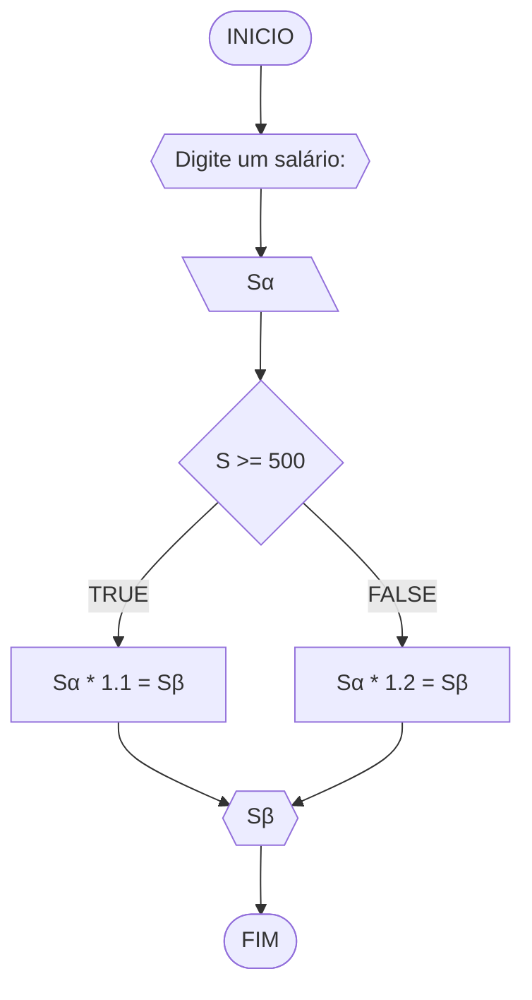
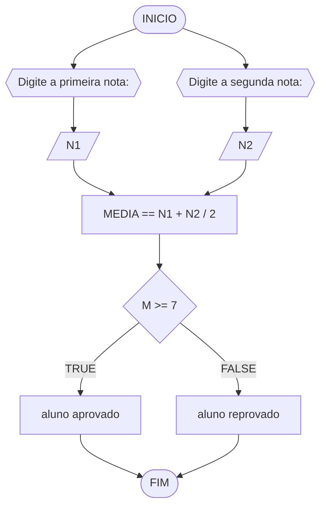
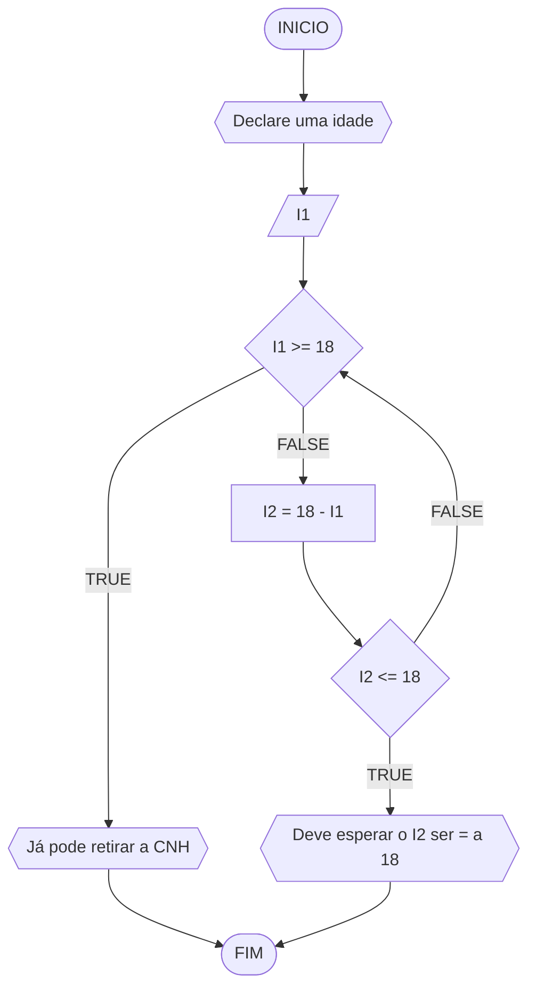

# UNIFOR
**Nome**: Gustavo Mendonça <br>
**Disciplina**: Raciocínio lógico algorítmico

## Lista de exercícios 01

### Exercício 01 
Represente, em fluxograma e pseudocódigo, um algoritmo para determinar se um número inteiro e positivo é par ou impar.

#### Fluxograma 

#### Pseudocódigo 
ALGORTIMO verifica_par_impar
DECLARE numero, resto: INTEIRO

INICIO

    // Insira seu comentário
    ESCREVA "Digite um número: "
    
    // Insira seu comentário
    LEIA numero
    
    // Insira seu comentário
    SE numero >= 0 ENTAO

        // Insira seu comentário
        resto <- numero % 2

        // Insira seu comentário
        SE resto == 0 ENTAO
            ESCREVA "O número é par!"

        // Insira seu comentário
        SENAO
          ESCREVA "O número é impar!"

        FIM_SE

    // Insira seu comentário
    SENAO             
        ESCREVA "O número deve ser postivo!"

    FIM_SE

FIM
#### Teste de mesa (0,25 ponto)
| N | N >= 0 | resto | resto == 0 | Saída |
| -- | -- | -- | -- | -- | 
| -4 | F |   |   | "O número deve ser postivo!" |
| 0  | V | 0 | V | "O número é par!" |
| 17 | V | 1 | F | "O número é impar!" |
| 60 | V | 0 | V | "O número é par!" |

###  Exercício 02


#### PSEUDOCODIGO

```mermaid
flowchart TD
ALGORITMO verificar_NOVO SALARIO
DECLARE Sα, Sβ NUMERICOS
ESCREVA "Digite seu salario atual: "
LEIA Sα
SE Sα >= 500 ENTAO
	Sβ = Sα * 1.1
SENAO
	Sβ = Sα * 1.2
ESCREVA "Seu novo salario é: ", Sβ
FIM ALGORITMO
```
#### Teste de mesa (1.0 ponto)

| Salário | Sα >= 500 | Saída |
|      --      |      --      |      --      |     
| 500     | V       | Sβ = Sα * 1.1    |  
| 300   | F          | Sβ = Sα * 1.2        | 

#### EXERCÍCIO 03




#### PSEUDOCÓDIGO

```
ALGORITMO verificar_MEDIA
Declare N1, N2, M NUMERICO
ESCREVA "Digite a primeira nota do aluno: "
LEIA Nota1
ESCREVA "Digite a segunda nota do aluno: "
LEIA Nota2
MEDIA = (N1 +N2) / 2
SE ME >= 7 ENTAO
	ESCREVA "aluno aprovado "
SENAO
	ESCREVA "aluno reprovado "
FIM ALGORITMO 


```
#### Teste de mesa (1 ponto)

| N1 | N2 | M | M >= 7.00 | SAIDA |
|      --      |      --      |      --      |      --      |      --      |
| 10.00     | 4.00      | 7.00    |  7.00 >= 7.00     | Aluno aprovado |
| 4.00   | 7.00          | 6.50        | 6.50 <= 7.00 | Aluno reprovado |

#### EXERCÍCIO 04



#### PSEUDOCODIGO

```mermaid
flowchart TD
ALGORITMO
VERIFICAR I1, I2 NUMERICOS
ESCREVA "Declare uma idade"
LEIA I1
SE I1 >= 18 ENTAO
	ESCREVA "Já pode retirar a CNH"
SENAO 
	I2 = 18 - I1 
	SE I2 <= 18 ENTAO
		ESCREVE "Deve sua idade ser igual a 18"
	SENAO
		ESCREVA "Verifique novamente sua idade"
FIM
```
#### Teste de mesa (1.0 ponto)

| I1 | I1 >= 18 | I2 | SAIDA | 
|      --      |      --      |      --      |      --      |
| 18     | 18 >= 18       | 0    |  Já pode tirar a CNH     |
| 19   | 19 >= 18          | -1        | Já pode tirar a CNH |``

