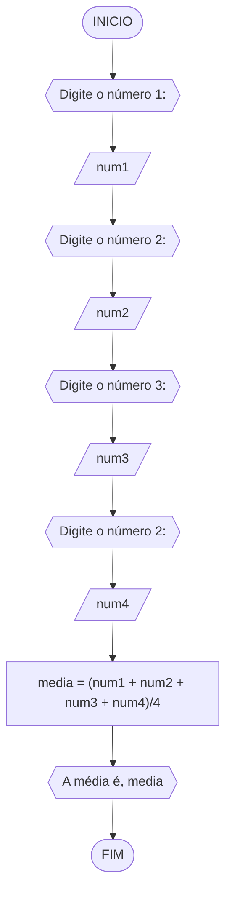
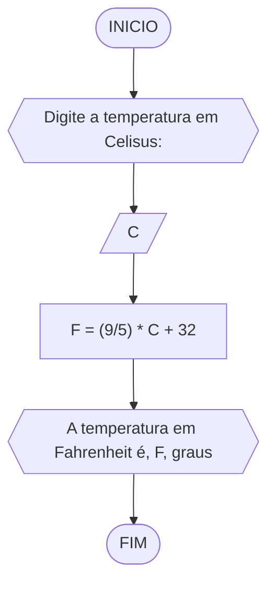
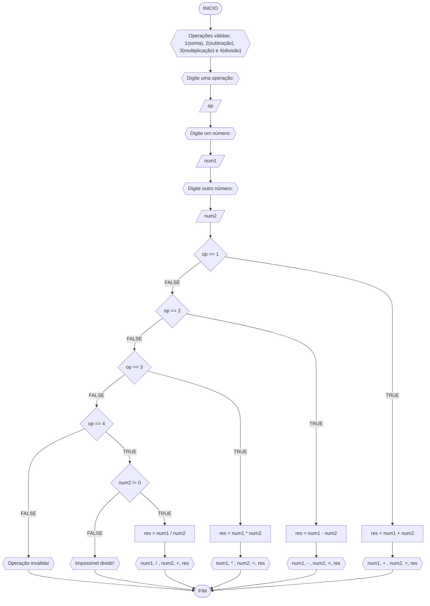
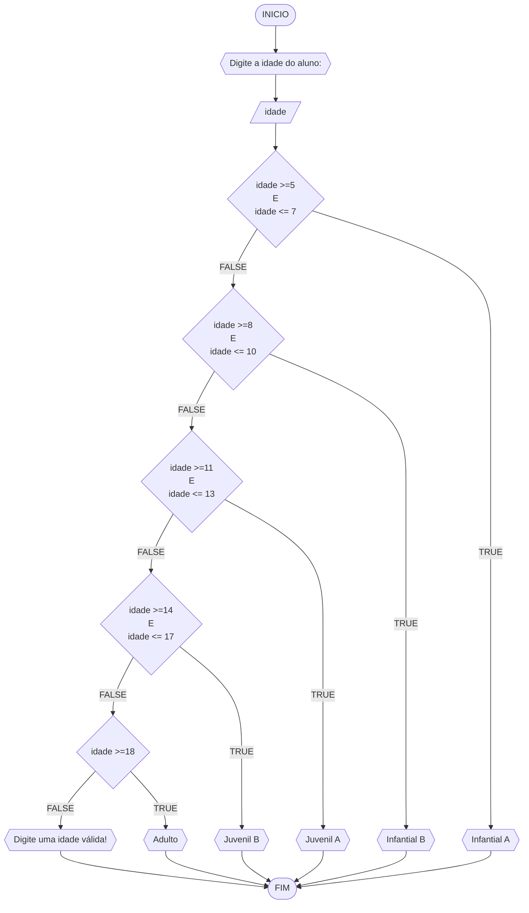

**Nome**: Gustavo Mendonça <br>
**Disciplina**: Raciocínio lógico algorítmico

 ## Lista de exercícios 02
 
 ### Exercício 01 (2.5 pontos)
Calcule a média de quatro números inteiros dados.

#### Fluxograma (1.0 ponto)



#### Pseudocódigo (1.0 ponto)

```java
ALGORTIMO Media
DECLARE num1, num2, num3, num4: REAL

INICIO

    // dado de entrada para a primeira variável
    ESCREVA "Digite o número 1:"

    // armazena a variável num1
    LEIA num1

    // dado de entrada para a segunda variável
    ESCREVA "Digite o número 2:"

    // armazena a variável num2
    LEIA num2

    // dado de entrada para a terceira variável
    ESCREVA "Digite o número 3:"

    // armazena a variável num3
    LEIA num3

    // dado de entrada para a quarta variável
    ESCREVA "Digite o número 4:"

    // armazena a variável num4
    LEIA num4

    // calcula a média da soma das variáveis por 4
    media <- (num1 + num2 + num3 + num4)/4
    ESCREVA "A média é", media

FIM
```

#### Teste de mesa (0.5 ponto)

| num1 | num2 | num3 | num4 | saída | 
| --   | --   | --   | --   | --    | 
| 0.25 | 0.25 | 2.50 | 1.00 | 1.00  | 

### Exercício 02 (2.5 pontos)
Leia uma temperatura dada em Celsius (C) e imprima o equivalente em Fahrenheit (F). (Fórmula de conversão: F = (9/5) * C + 32)

#### Fluxograma (1.0 ponto)



#### Pseudocódigo (1.0 ponto)

```java
ALGORTIMO ConverteCelsiusFarenheit
DECLARE C, F: REAL

INICIO

    // exibe a mensagem para a entrada de dados
    ESCREVA "Digite a temperatura em Celisus:"

    // armazena a variável C como dado de entrada
    LEIA C

    // calcula a temperatura em fahrenheit utilizando a fórmula de conversão
    F <- (9/5) * C + 32

    // exibe a mensagem informando a temperatura em fahrenheit
    ESCREVA "A temperatura em Fahrenheit é", F, "graus"

FIM
```

#### Teste de mesa (0.5 ponto)

| C  | F  | saída                                  | 
| -- | -- | --                                     |
| 0  | 32 | A temperatura em Fahrenheit é 32 graus |

### Exercício 03 (2.5 pontos)
Receba dois números reais e um operador e efetue a operação correspondente com os valores recebidos (operandos). 
O algoritmo deve retornar o resultado da operação selecionada simulando todas as operações de uma calculadora simples.

#### Fluxograma (1.0 ponto)



#### Pseudocódigo (1.0 ponto)

```java
ALGORITMO CalculadoraSimples
DECLARE op: INTEIRO; num1,num2,res: REAL

INICIO

    // exibe uma mensagem armazenando as quatro operações básicas
    ESCREVA "Operações válidas: 1(soma), 2(subtração), 3(multiplicação) e 4(divisão)"

    // exibe uma mensagem para a entrada de dados
    ESCREVA "Digite uma operação:"

    // armazena a variável op
    LEIA op

    // variável num1 como dado de entrada
    ESCREVA "Digite um número:"
    LEIA num1

    // variável num2 como dado de entrada
    ESCREVA "Digite outro número:"
    LEIA num2

    // determinar a operação a ser utilizada entre as variáveis
    ESCOLHA

        // executa as instruções caso a operação escolhida seja de soma (+)
        CASO op == 1

            // calcula o resultado somando as variáveis num1 e num2
            res = num1 + num2

            // exibe uma mensagem informando o resultado da soma
            ESCREVA num1, "+", num2, "=", res

        // executa as instruções caso a operação escolhida seja subtração (-)
        CASO op == 2

            // calcula o resultado subtraindo as variáveis num1 e num2
            res = num1 - num2

            // exibe uma mensagem informando o resultado da subtração
            ESCREVA num1, "-", num2, "=", res

        // executa as instruções caso a operação escolhida seja multiplicação (*)
        CASO op == 3

            // calcula o resultado do produto das variáveis num1 e num2
            res = num1 * num2

            // exibe uma mensagem informando o resultado da multiplicação 
            ESCREVA num1, "*", num2, "=", res

        // executa as instruções caso a operação escolhida seja divisão (/)
        CASO op == 4

            // executa as instruções caso a variável num2 seja diferente de 0
            SE num2 != 0 ENTAO

                // calcula o resultado da razão entre as variéveis num1 e num3=2
                res = num1 / num2

                // exibe uma mensagem informando o resultado da divisão
                ESCREVA num1, "/", num2, "=", res

            // executa a instrução se a variável num2 for igual a 0
            SENAO
                ESCREVA "Impossível dividir!"

            FIM_SE

    // executa a instrução caso nenhuma das operações seja selecionada
    SENAO
        ESCREVA "Operação inválida!"

    FIM_ESCOLHA

FIM
```

#### Teste de mesa (0.5 ponto)

| num1 | num2 | op | num2 != 0 | res | saída               | 
| --   | --   | -- | --        | --  | --                  |
| 1    | 0    | 1  |           | 1   | 1 + 0 = 1           |
| 1    | 0    | 2  |           | 1   | 1 - 0 = 1           |
| 1    | 0    | 3  |           | 0   | 1 * 0 = 0           |
| 1    | 0    | 4  | False     |     | Impossível dividir! |
| 1    | 2    | 4  | True      | 0.5 | 1 / 2 = 0,5         |
| 1    | 2    | 5  |           |     | Operação inválida!  |

### Exercício 04 (2.5 pontos)
Elaborar um algoritmo que, dada a idade, classifique nas categorias: infantil A (5 - 7 anos), infantil B (8 -10 anos), juvenil A (11 - 13 anos), juvenil B (14 -17 anos) e adulto (maiores que 18 anos).

#### Fluxograma (1.0 ponto)



#### Pseudocódigo (1.0 ponto)

```
ALGORTIMO ClassificaCategoria
DECLARE idade: INTEIRO

INICIO

    // exibe uma mensagem para a entrada de dados
    ESCREVA "Digite a idade do aluno:"

    // armazena a variável "idade" para representar a idade do aluno
    LEIA idade

    // condição do tipo caso
    ESCOLHA

        // executa as instruções caso a condição "idade >=5 E idade <= 7" seja verdadeira
        CASO idade >=5 E idade <= 7

            // exibe uma mensagem categorizando o aluno como Infantil A
            ESCREVA "Infantial A"

        // executa as instruções caso a condição "idade >=8 E idade <= 10" seja verdadeira
        CASO idade >=8 E idade <= 10

            // exibe uma mensagem categorizando o aluno como Infantil B
            ESCREVA "Infantial B"

        // executa as instruções caso a condição "idade >=11 E idade <= 13" seja verdadeira
        CASO idade >=11 E idade <= 13

            // exibe uma mensagem categorizando o aluno como Juvenil A
            ESCREVA "Juvenil A"

        // executa as instruções caso a condição "idade >=14 E idade <= 17" seja verdadeira
        CASO idade >=14 E idade <= 17

            // exibe uma mensagem categorizando o aluno como Juvenil B
            ESCREVA "Juvenil B"

        // executa as instruções caso a condição "idade >=18" seja verdadeira
        CASO idade >=18

            // exibe uma mensagem categorizando o aluno como Adulto
            ESCREVA "Adulto"

    // executa as instruções caso a idade do aluno não se encaixe em nenhuma categoria
    SENAO

        // exibe a mensagem solicitando o envio de uma idade válida
        ESCREVA "Digite uma idade válida!"

    FIM_ESCOLHA

FIM
```

#### Teste de mesa (0.5 ponto)

| idade | idade >=8 E idade <= 10 | idade >=11 E idade <= 13 | idade >=14 E idade <= 17 | idade >=18 | saída                       | 
| --    | --                      | --                       | --                       | --         | --                          |
| 4     | False                   | False                    | False                    | False      | Digite uma idade válida!    |
| -4    | False                   | False                    | False                    | False      | Digite uma idade válida!    |
| 8     | True                    | False                    | False                    | False      | Infantial A                 |
| 11    | False                   | True                     | False                    | False      | Infantial B                 |
| 17    | False                   | False                    | True                     | False      | Infantial C                 |
| 21    | False                   | False                    | False                    | True       | Adulto                      |
