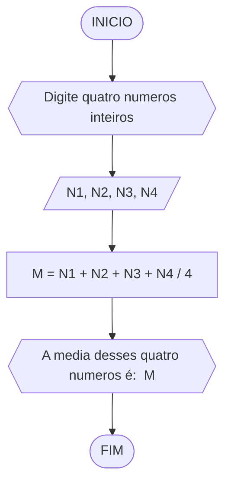
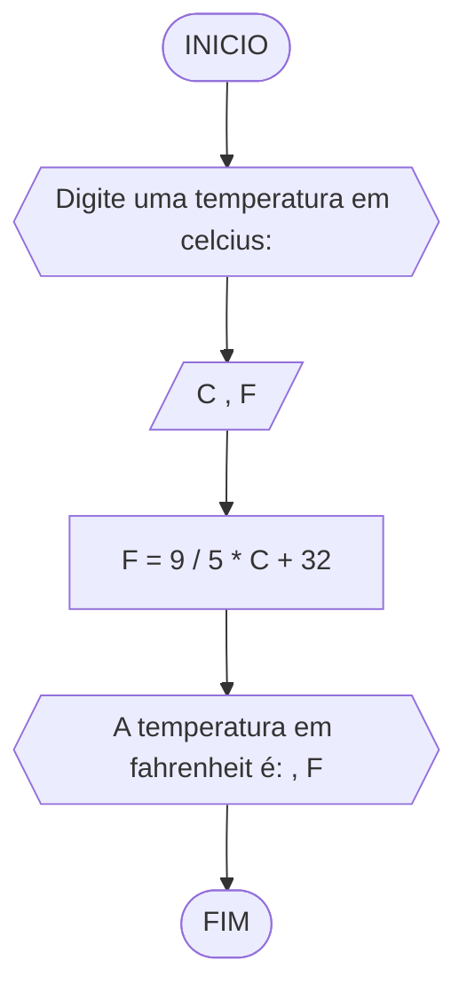
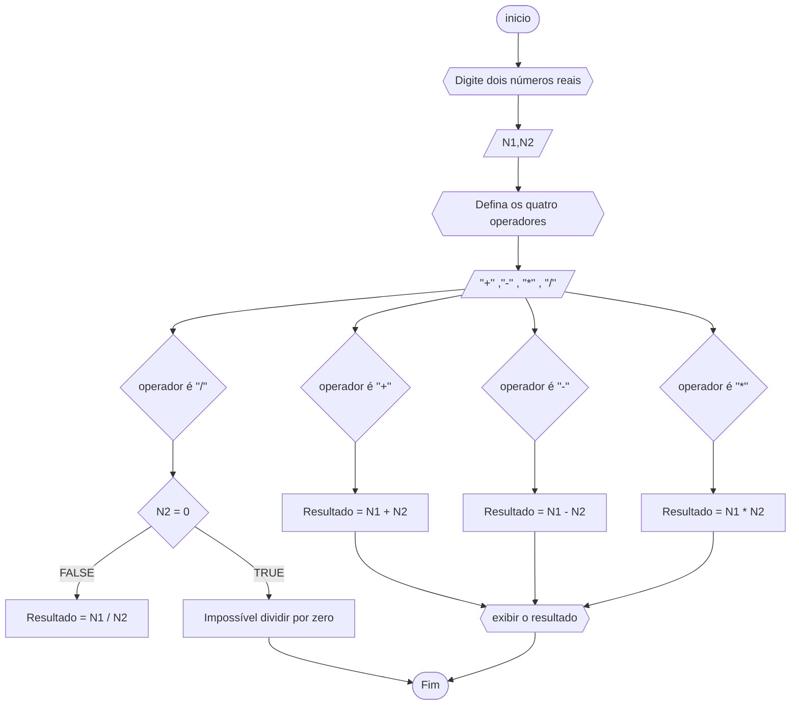

# UNIFOR
**Nome**: Gustavo Mendonça <br>
**Disciplina**: Raciocínio lógico algorítmico

 ## Lista de exercícios

### Exercício 01 (2.5 pontos)
Calcule a média de quatro números inteiros dados.

#### FLUXOGRAMA


#### PSEUDOCODIGO

```
ALGORITMO media
DECLARE N1, N2, N3, N4 INTEIROS
INICIO
ESCREVA "Digite quatro numeros inteiros: "
LEIA N1, N2, N3, N4
M = N1 + N2 + N3 + N4 / 4 
	ESCREVA "A media desses quatro numeros é: ", M
FIM


```

#### Teste de mesa (0.5 ponto)

| N1 | N2 | N3 | N4 | M | SAIDA | 
|      --      |      --      |      --      |      --      |      --      |      --      | 
| 2     | 4       | 6    |  8     | 5    |      Média = 5      |
| 1   | 3          | 5        | 7 | 4  |      Média = 4      |

### Exercício 02 (2.5 pontos)
Leia uma temperatura dada em Celsius (C) e imprima o equivalente em Fahrenheit (F). (Fórmula de conversão: F = (9/5) * C + 32)

#### FLUXOGRAMA


#### PSEUDOCODIGO


```
ALGORITMO temperatura
DECLARE C, F REAIS
INICIO
ESCREVA "Digite uma temperatura em celcius: "
LEIA C
F = 9 / 5 * C + 32 ENTAO
	ESCREVA "A temperatura em fahrenheit é: ", F
FIM


```

#### Teste de mesa (0.5 ponto)

|C | F = 9 / 5 * C + 32 | F | 
|      --      |      --      |      --      |    
| 30     |   F = 9 / 5 * 30 + 32      | 86   |  
| 60   |  F = 9 / 5 * 60 + 32          | 140       | 

### Exercício 03 (2.5 pontos)
Receba dois números reais e um operador e efetue a operação correspondente com os valores recebidos (operandos). 
O algoritmo deve retornar o resultado da operação selecionada simulando todas as operações de uma calculadora simples.



#### PSEUDOCODIGO

```
ALGORITMO media
DECLARE N1, N2, REAIS
DECLARE operadores
INICIO
ESCREVA "Digite dois números reais: "
	LEIA N1, N2
ESCREVA "Defina os operadores: "
	LEIA + ,- , * , /
Se  operador é "+" 
	Resultado = N1 + N2
Senão operador é "-"
	Resultado = N1  -  N2
Senão operador é "*"
	Resultado = N1  *  N2
Senão operador é "/"
	Se  N2 = 0
		Exibir "Impossível dividir por zero"
	Senão Resultado = A / B
Fim  Se
Exibir resultado
FIM


```
#### teste de mesa

|  N1  |  N2  |  Operador  |  Resultado  |  FIM
|      --      |      --      |      --      |      --      |       --      |
|  12  |  18  |  +  |  12 + 18  |  30  |
|  30  |  16  |  -  |  30 - 16  |  14  |
|  12  |  10  |  *  |  12 * 10  |  120  |
|  20  |  2  |  /  |  20 / 2  |  10  |
|  16  |  0  |  /  |  16 / 0  |  Impossível dividir por zero  |


