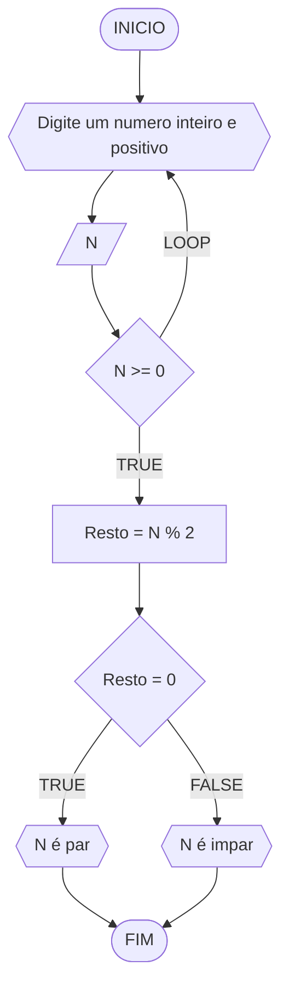
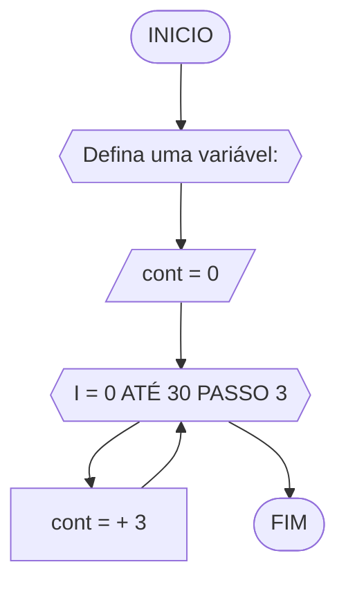
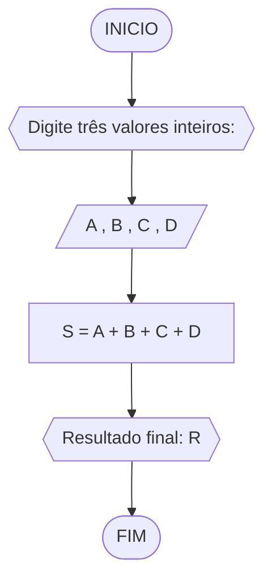

# UNIFOR
**Nome**: Gustavo Mendonça <br>
**Disciplina**: Raciocínio lógico algorítmico

 ## Lista de exercícios

 ### Exercício 01 (2.5 pontos)
Atualize o algoritmo para determinar se um número inteiro e positivo é par ou ímpar, usando uma laço condicional para aceitar apenas números maiores ou iguais a zero.

### fluxograma

#### Pseudocódigo 
```
ALGORITMO ClassificaCategoria
DECLARE N, Resto : INTEIROS
INICIO
REPITA
	ESCREVA "Digite um numero inteiro e positivo"
	LEIA N
	ATE_QUE N >= 0 ENTAO
	Resto = N % 2
	SE Resto = 0 ENTAO
		ESCREVA "N é par"
	SENAO 
		ESCREVA "N é impar"
	FIM_SE
FIM_ALGORITMO

```
#### Teste de Mesa
| N | Resto = N % 2 |  resto  | Saída | 
| -- | -- | -- | --|
| 9 | Resto = 9 % 2 |1| "impar" |
| 24 | Resto = 24 % 2 |0| "par" |
| 15 | Resto = 15 % 2 |1| "impar" |
| 1 | Resto = 1 % 2 |1| "impar" |

### Exercício 02 (2.5 pontos)
Faça um algoritmo que exiba na tela uma contagem de 0 até 30, exibindo apenas os múltiplos de 3.


	#### Pseudocódigo 

```
Algoritmo ClassificaCategoria
	DECLARE 30, I, cont: INTEIRO
INICIO
ESCREVA “Defina uma variável: ”
	LEIA cont 
	cont = 0
		PARA i DE 0 ATÉ 30 PASSO 3 FAÇA
			cont = cont + I
		FIM_PARA
FIM_ALGORITMO
```
#### Teste de Mesa
| N | cont |  i  | cont = +3 | 
| -- | -- | -- | --|
| 30 | 0 | 1 | 3 |
| 30 | 3 | 2 | 6 |
| 30 |6 | 3 | 9 |
| 30 | 9 | 4 | 12 |
| 30 | 12 | 5 | 15 |
| ... | ... |...| ... |
| 30 | 27 | 10 | 30|

### Exercício 03 (2.5 pontos)
Dada uma sequência de números inteiros, calcular a sua soma. 
Por exemplo, para a sequência {12, 17, 4, -6, 8, 0}, o seu programa deve escrever o número 35.



#### pseudocódigo
```
ALGORITMO soma
DECLARE A ,  B , C , D , S inteiros
INÍCIO
ESCREVA "Digite três valores inteiros:"
LEIA  A ,  B , C , D
S = A + B + C + D
	ESCREVA "Resultado final: R: "
FIM
```
