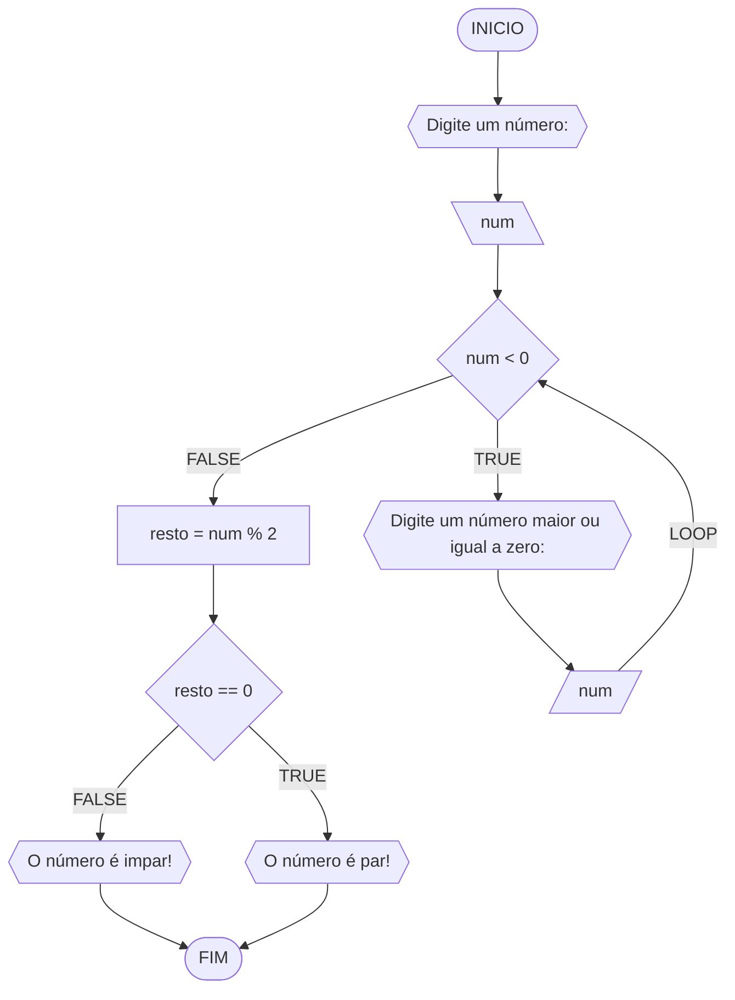
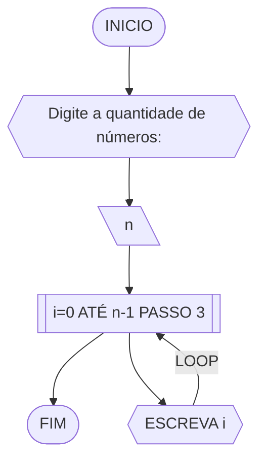
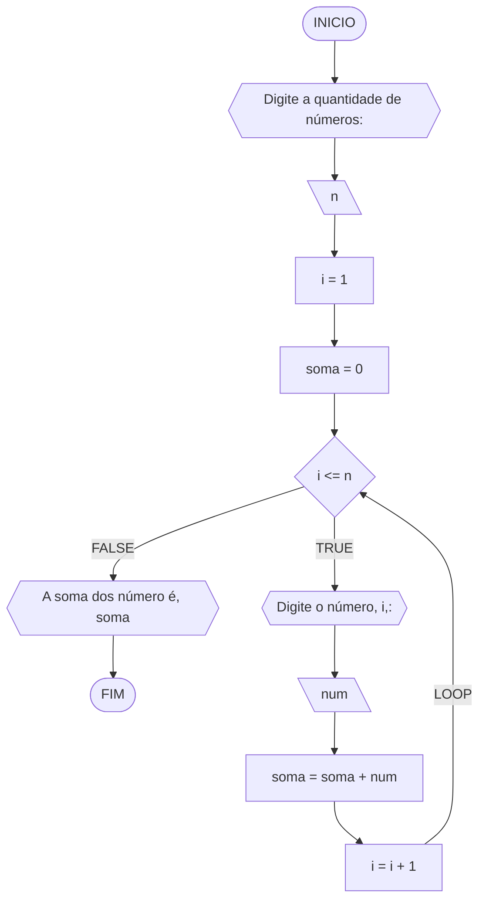
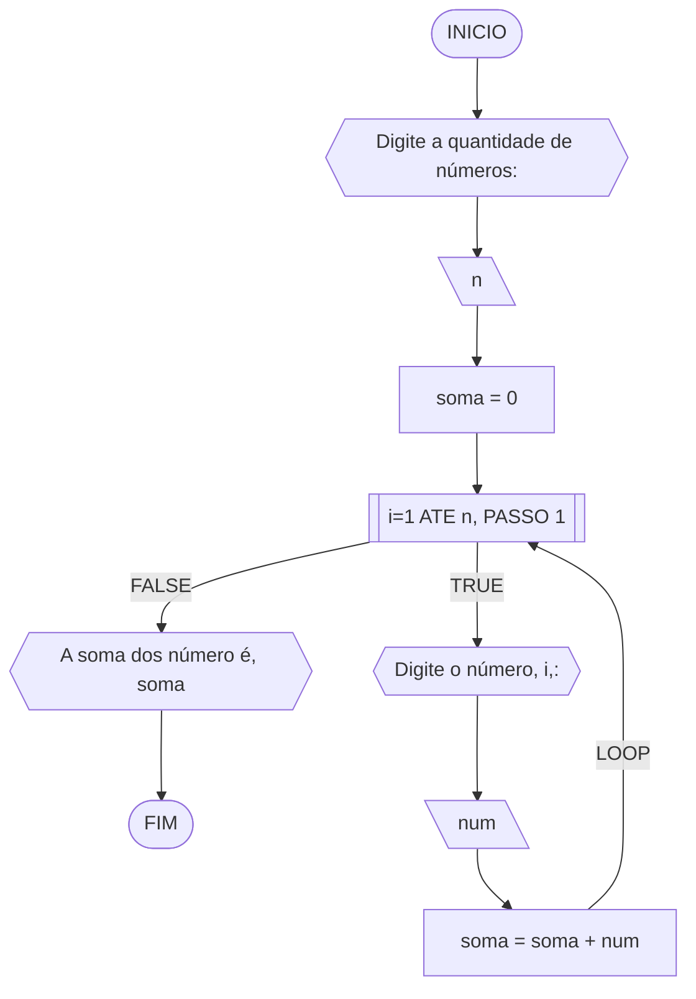
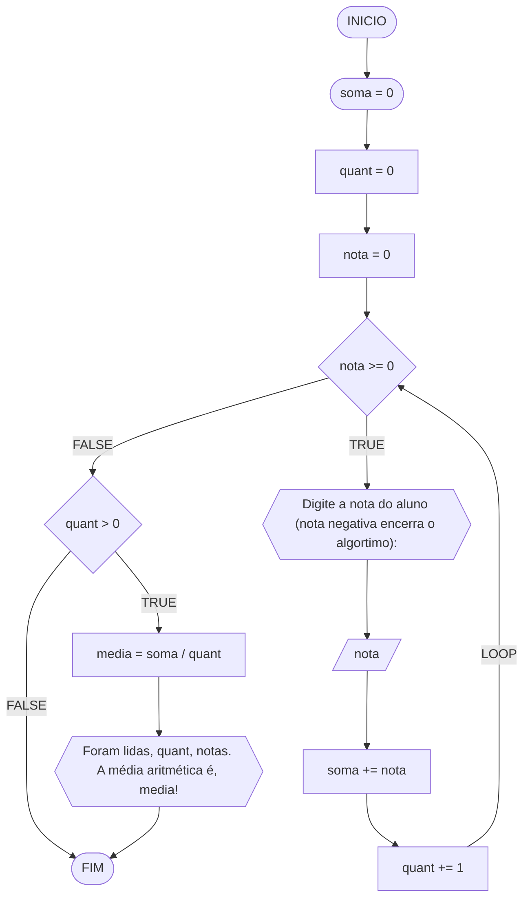

**Nome**: Gustavo Mendonça <br>
**Disciplina**: Raciocínio lógico algorítmico

 ## Lista de exercícios

 ### Exercício 01 (2.5 pontos)
Atualize o algoritmo para determinar se um número inteiro e positivo é par ou ímpar, usando uma laço condicional para aceitar apenas números maiores ou iguais a zero. 

#### Fluxograma (1.0 ponto)



#### Pseudocódigo (1.0 ponto)

```java
ALGORTIMO verifica_par_impar
DECLARE numero, resto: INTEIRO
ESCREVA "Digite um número: "
INICIO
  LEIA numero
  SE numero >= 0 ENTAO                  // verifica se o inteiro é positivo
    resto ← numero % 2                 // calcula o resto da divisão por 2
    SE resto == 0 ENTAO                // verifica se o resto é igual a zero
      ESCREVA "O número é par!"
    SENAO
      ESCREVA "O número é impar!"
    FIM_SE
  SENAO                                // caso inteiro for negativo (condição linha 5)
    ESCREVA "O número deve ser postivo!"
  FIM_SE
FIM
```

#### Tabela de testes (0.5 ponto)

| num | num < 0 | num | resto | resto == 0 | saída             | 
| --  | --      | --  | --    | --         | --                | 
| -1  | True    | 0   | 0     | True       | O número é par!   |
| 1   | False   |     | 1     | False      | O número é impar! |
| 2   | False   |     | 0     | True       | O número é par!   |

### Exercício 02 (2.5 pontos)
Faça um algoritmo que exiba na tela uma contagem de 0 até 30, exibindo apenas os múltiplos de 3.

#### Fluxograma (1.0 ponto)



#### Pseudocódigo (1.0 ponto)

```java
ALGORTIMO MultiploTres
DECLARE n: INTEIRO
INICIO
  ESCREVA "Digite a quantidade de números:"
  LEIA n
  PARA i DE 0 ATÉ n-1 PASSO 3 FAÇA
    ESCREVA i
  FIM_PARA
FIM
```

#### Tabela de testes (0.5 ponto)

| it | n   | i  | saida | 
| -- | --  | -- | --    |    
| 1  | 7   | 0  | 0     |
| 2  | 7   | 3  | 3     |
| 3  | 7   | 6  | 6     |

### Exercício 03 (2.5 pontos)
Dada uma sequência de números inteiros, calcular a sua soma. 
Por exemplo, para a sequência {12, 17, 4, -6, 8, 0}, o seu programa deve escrever o número 35.

#### Fluxograma 1



#### Fluxograma 2


#### Pseudocódigo (1.0 ponto)

```java
ALGORITMO SomaValores
DECLARE n,i: INTEIRO; soma,num: REAL
INICIO
  ESCREVA "Digite a quantidade de números:"
  LEIA n
  soma <- 0
  i <- 1
  ENQUANTO i <= n FAÇA
    ESCREVA "Digite o número", i,":"
    LEIA num
    soma <- soma + num
    i <- i + 1
  FIM_ENQUANTO
  ESCREVA "A soma dos número é", soma
FIM
```

#### Tabela de testes (0.5 ponto)

| n  | soma | i  | i <= n | num | soma + num | i + 1   | saída                      |  
| -- | --   | -- | --     | --  | --         | --      | --                         |
| -1 | 0    | 1  | False  |     |            |         | A soma dos número é 0      |
| 0  | 0    | 1  | False  |     |            |         | A soma dos número é 0      |
| 3  | 0    | 1  | True   | 10  | 0+10 = 10  | 1+1 = 2 |                            |
| 3  | 10   | 2  | True   | 20  | 10+20 = 30 | 2+1 = 3 |                            |
| 3  | 30   | 3  | True   | 30  | 30+30 = 60 | 3+1 = 4 |                            |
| 3  | 60   | 4  | False  |     |            |         | A soma dos número é 60     |

### Exercício 04 (2.5 pontos)
Escreva um programa que leia a nota de diversos alunos, até que seja digitada uma nota negativa. 
Nesse momento, ele mostra a média aritmética de todas as notas lidas e quantas notas foram lidas. 
Ex. Foram lidas 14 notas. A média aritmética é 6.75!

#### Fluxograma



#### Pseudocódigo

```java
ALGORTIMO QuantMedia
DECLARE quant: INT; soma, nota, media: REAL
INICIO
  soma <- 0
  quant <- 0
  nota <- 0
  ENQUANTO nota >= 0 FAÇA
    ESCREVA "Digite a nota do aluno (nota negativa encerra o algortimo:"
    LEIA nota
    soma <- soma + nota
    quant <- quant + 1
    SE quant > 0 ENTAO
      media <- soma / quant
  ESCREVA "Foram lidas", quant, "notas. A média aritmética é", media, "!"
FIM
```

#### Tabela de testes (0.5 ponto)

| it  | soma | quant | nota | nota  | soma + nota | quant + 1 | media    | saída                                         | 
| --  | --   | --    | --   | --    | --          | --        | --       | --                                            |
| 1   | 0    | 0     | 0    | 0     | 0           | 0+1=1     | 0/1=0    |                                               |
| 2   | 0    | 0     | 0    | -1    |             |           |          |                                               |
| 1   | 0    | 0     | 0    | -1    |             |           |          |                                               |
| 1   | 0    | 0     | 0    | 40    | 0+40=40     | 0+1=1     |          |                                               |
| 2   | 0    | 0     | 0    | 60    | 40+60=100   | 1+1=2     |          |                                               |
| 3   | 0    | 0     | 0    | 20    | 100+20=120  | 2+1=3     |          |                                               |
| 4   | 0    | 0     | 0    | -1    |             |           | 120/3=40 | Foram lidas 3 notas. A média aritmética é 40! |
