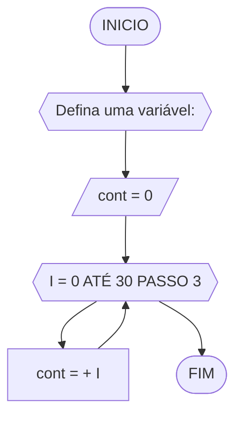

# UNIFOR
**Nome**: Gustavo Mendonça <br>
**Disciplina**: Raciocínio lógico algorítmico

 ## Lista de exercícios

 ### Exercício 01 (2.5 pontos)
Atualize o algoritmo para determinar se um número inteiro e positivo é par ou ímpar, usando uma laço condicional para aceitar apenas números maiores ou iguais a zero.

### fluxograma

#### Pseudocódigo 
```
ALGORITMO ClassificaCategoria
DECLARE N, Resto : INTEIROS
INICIO
REPITA
	ESCREVA "Digite um numero inteiro e positivo"
	LEIA N
	ATE_QUE N >= 0 ENTAO
	Resto = N % 2
	SE Resto = 0 ENTAO
		ESCREVA "N é par"
	SENAO 
		ESCREVA "N é impar"
	FIM_SE
FIM_ALGORITMO

```

### Exercício 02 (2.5 pontos)
Faça um algoritmo que exiba na tela uma contagem de 0 até 30, exibindo apenas os múltiplos de 3.


	#### Pseudocódigo 

```
Algoritmo ClassificaCategoria
	DECLARE 30, I, cont: INTEIRO
INICIO
ESCREVA “Defina uma variável: ”
	LEIA cont 
	cont = 0
		PARA i DE 0 ATÉ 30 PASSO 3 FAÇA
			cont = cont + I
		FIM_PARA
FIM_ALGORITMO
```
